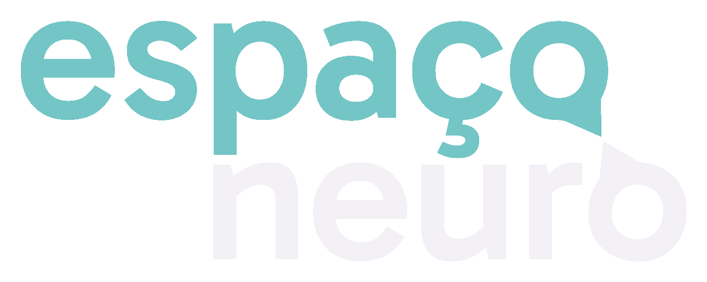

# Espaco Neuro

<p align="center">
  
</p>

<p align="center">
  Site institucional e painel administrativo da clínica Espaço Neuro, construído com Phoenix LiveView para oferecer uma experiência rápida, editorial e fácil de manter.
</p>

<p align="center">
  
  
  
  
  
  
</p>

## Visão geral

O projeto combina uma área pública voltada para apresentação da clínica com um painel autenticado para gestão de serviços e profissionais. A interface principal é renderizada com LiveView, o catálogo é persistido em PostgreSQL via Ecto, e uploads de imagens são enviados diretamente para S3 com URLs pré-assinadas.

## Screenshots


## O que existe no app

- Área pública com páginas de início, serviços, equipe e páginas de detalhe por slug.
- Painel administrativo autenticado para gerenciar serviços e profissionais.
- Modelagem editorial com ordenação, status de publicação e relacionamento entre profissionais e serviços.
- Upload direto para S3 para fotos e ativos do catálogo.
- Fluxo de contato por e-mail usando Swoosh com adapter Resend.
- Deploy preparado para Fly.io com migrations no release e health check em `/healthz`.

## Stack

| Camada | Tecnologias |
|--------|-------------|
| Backend | Elixir, Phoenix 1.8, Bandit |
| Reatividade | Phoenix LiveView 1.1 |
| Dados | Ecto, PostgreSQL |
| UI | Tailwind CSS v4, tokens customizados, Heroicons, daisyUI plugin |
| Auth | `phx.gen.auth` com rotas protegidas para `/admin` |
| Arquivos | ExAws + S3 presigned uploads |
| E-mail | Swoosh + Resend |
| HTTP client | Req |
| Deploy | Fly.io release + Docker |

## Arquitetura rápida

- `lib/espaco_neuro_web/router.ex`: separa rotas públicas, autenticação e área admin protegida.
- `lib/espaco_neuro/catalog.ex`: contexto principal do catálogo de serviços e profissionais.
- `lib/espaco_neuro/upload.ex`: geração de presigned URLs e remoção de objetos no S3.
- `lib/espaco_neuro/contact.ex`: validação simples e envio de mensagens de contato.
- `priv/repo/seeds.exs`: dados iniciais para desenvolvimento local.

## Setup local

### Requisitos

- Elixir `~> 1.15`
- PostgreSQL
- Node.js

### Rodando o projeto

```bash
mix setup
mix phx.server
```

Aplicação local: `http://localhost:4000`

## Variáveis de ambiente

| Variável | Descrição | Obrigatória |
|----------|-----------|:-----------:|
| `DATABASE_URL` | URL do Postgres | Prod |
| `SECRET_KEY_BASE` | Chave de sessão e criptografia do Phoenix | Prod |
| `PHX_HOST` | Domínio público da aplicação | Prod |
| `RESEND_API_KEY` | Chave da API do Resend | Prod |
| `CONTACT_EMAIL` | E-mail que recebe mensagens do site | Não |
| `AWS_ACCESS_KEY_ID` | Credencial IAM para upload no S3 | Sim |
| `AWS_SECRET_ACCESS_KEY` | Secret IAM | Sim |
| `AWS_REGION` | Região AWS, default `sa-east-1` | Não |
| `S3_BUCKET` | Bucket usado para uploads | Sim |
| `ADMIN_EMAIL` | E-mail do admin no seed local | Não |
| `ADMIN_PASSWORD` | Senha do admin no seed local | Não |

## Deploy

O repositório já está preparado para release em Fly.io, com command de migration no deploy e endpoint de health check.

```bash
fly launch
fly secrets set DATABASE_URL=... SECRET_KEY_BASE=... \
  RESEND_API_KEY=... AWS_ACCESS_KEY_ID=... \
  AWS_SECRET_ACCESS_KEY=... AWS_REGION=sa-east-1 \
  S3_BUCKET=... PHX_HOST=espaconeuro.com.br
fly deploy
```

Arquivo principal de infraestrutura: [`fly.toml`](fly.toml)

## CORS do bucket S3

Para upload direto do navegador, o bucket precisa permitir `PUT` a partir do domínio do site e do ambiente local:

```json
[
  {
    "AllowedHeaders": ["*"],
    "AllowedMethods": ["PUT"],
    "AllowedOrigins": ["https://espaconeuro.com.br", "http://localhost:4000"],
    "ExposeHeaders": []
  }
]
```

## Qualidade

```bash
mix test
mix precommit
```

O alias `mix precommit` roda compile com warnings como erro, limpa deps não usadas, formata o código e executa a suíte de testes.
